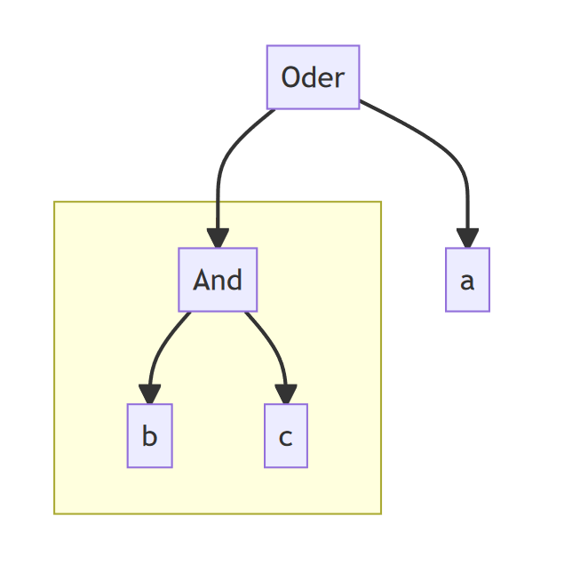

# Übung 08 Vererbung

- [Einführung Übung 8](usefulTips/uebung-08-einfuerung.pdf)
- [Hilfestellungen](#hilfestellungen)


## Kernthemen
- „dynamische“ Erweiterung eines Arrays
- Anwenden von abstrakten Klassen und Methoden
- Implementierung einer Vererbungsstruktur
- Anwendung des Polymorphismus

## Aufgabe 01: Datenstrukturen
In dieser Aufgabe implementieren Sie eine Datenstruktur die es erlaubt Boolesche Formeln als Bäume
darzustellen. Dazu werden im Folgenden verschiedene Klassen von der Oberklasse Knoten abgeleitet:

````java
public abstract class Knoten { 
    public abstract Boolean getWert();
    
    @Override
    public String toString(){
        if(getWert()){
            return "1";
        }else{
            return "0";
        }
    }
}
````

Wie sie sehen können, handelt es sich dabei um eine s.g. abstrakte Klasse. Diese können nicht
instanziiert werden, das bedeutet es lassen sich keine Objekte mit new daraus erzeugen. Trotzdem
können sie bereits Methoden und Attribute bereitstellen, die sich dann mittels Vererbung in anderen
Klassen weiterverwenden lassen. Außerdem ist es möglich abstrakte Methodenrümpfe vorzudefinieren,
die zwar hier keine Implementierung haben, aber von den Klassen implementiert werden müssen, die
von dieser abstrakten Klasse erben. Hier ist das z.B. die Methode getWert(). Klassen die von Knoten
ableiten sind entweder selber abstrakt oder müssen die Methode getWert() überschreiben.  

Folgende Klasse Startup verwendet bereits die von Ihnen zu implementierende Datenstruktur. Hier wird
eine einfache Boolesche Formel erzeugt Baum = a OR ( b AND c ).

````java
public class Startup {
    public static void main(String[] args) {
        Basisereignis a = new Basisereignis(true);
        Basisereignis b = new Basisereignis(false);
        Basisereignis c = new Basisereignis(true);
    
        Oder baum = new Oder();
        baum.addKnoten(a).addKnoten(new Und().addKnoten(b).addKnoten(c));
        System.out.println(baum);
    }
}
````
- Implementieren Sie zunächst die Klasse Basisereignis die von der Klasse Knoten erbt.
  Implementieren Sie zusätzliche Funktionalität so, dass ein Basisereignis den Wert true oder
  false annehmen kann.
- Implementieren Sie die abstrakte Klasse ErweiterbarerKnoten die die Klasse Knoten
  erweitert und die als Attribut ein Array von Knoten hat, die Unterknoten, und eine Methode
  addKnoten(Knoten k) bereitstellt mit Hilfe derer sich ein neuer Knoten k zu den
  Unterknoten hinzufügen lässt. Diese Methode gibt ihr eigenes Objekt zurück, damit sie sich wir
  in oben dargestellter Weise aufrufen lässt.
- Implementieren Sie die Klasse Oder, die von der Klasse ErweiterbarerKnoten erbt.
  Überschreiben Sie die Methode getWert so, dass eine Veroderung der Werte der Unterknoten
  entsteht.
- Implementieren Sie die Klasse Und in ähnlicher Weise wie die Klasse Oder aus Aufgabe c.
- Implementieren Sie geeignete Testfälle für die Klassen Oder und Und.

## Hilfestellungen

In dieser Übung beschäftigen Sie sich mit der Vererbung und abstrakten Klassen. Sie üben das Ganze, indem Sie sich eine Datenstruktur aufbaut, mit der Sie boolsche Ausdrücke als Baum darstellen können. Dies sind so genannte Syntaxbäume. Zunächst ein paar Definitionen und Hinweise bzgl boolscher Ausdrücke und Bäume:
- Atomare Formeln sind die Booleschen Konstanten 0 (false) und 1 (true) wie auch Variablen a, b, c, etc.
- Boolsche Terme setzen sich aus atomaren Formeln und Junktoren(&&, ||, !, ^) zusammen
- Boolsche Terme können weiter aus Boolschen Termen und atomaren Formel zusammengesetzt werden.

Boolsche Terme können durch Syntaxbäume veranschaulicht werden:
- Eine atomare Formel wird durch einen Knoten mit Variablennamen dargestellt
- Ein Boolscher Term besitzt einen Knoten der den Junktor beinhaltet und 1 oder 2 Unterknoten. Diese können selbst wieder Boolsche Terme sein oder auch atomare Formeln.
- Letztere nennt man dann auch Blätter des Baums.4

Hier ein Beispiel eines Syntaxbaumes:  
  
Dies entspricht dem Boolschen Term:     Baum = a OR ( b AND c ) der Übung 8.

Wenn Sie sich generell über Syntaxbäume weiter erkundigen wollen, können Sie sich folgendes Video in Youtube ansehen:
https://www.youtube.com/watch?v=oJjRXgCb5S4

Wenn Sie sich nochmals über Boolsche Funktionen informieren wollen, können Sie sich folgendes Video ansehen:
https://www.youtube.com/watch?v=MhS_NHY-aRI

Für diese Übung implementieren Sie atomare Formeln als Basisereignisse. Diese können also Werte "true" oder "false"
annehmen, und auf diese Werte kann über eine getter und setter Methode zugegriffen werden. Basisereignisse
erben von Knoten, getWert() muss also implementiert werden.
Knoten, welche boolsche Terme und damit Junktoren wiederspiegeln sollen, werden Sie als ErweiterbarerKnoten
implementiert. ErweiterbarerKnoten erbt von Knoten, ist ebenfalls abstrakt, hat als Objektattribut ein Knoten[]
, in welchem die Unterknoten abgespeichert werden. Weiter soll in dieser Klasse auch eine Methode addKnoten()
implementiert werden, welche das Knoten[] um einen Knoten erweitert, den Zustand des ErweiterbarenKnotens 
um das neue Knoten[] aktualisiert, und diesen dann auch als Ergebnis zurück liefert.
Weiter implementieren Sie die Klassen Oder und Und, beide erben von ErweiterbarerKnoten und überschreiben die getWert()
Methode, so dass im Falle Oder eine "Veroderung" stattfindet, und im Falle Und eine "Verundung" stattfindet.


Testen Sie Ihre Implementierung und stellen Sie damit sicher, dass Ihre Implementierung klappt.

Klappen auch folgende Boolschen Ausdrücke?
- Baum = a AND( b OR c )
- Baum = (a AND b) OR c
- Baum = (A OR b) AND c
- Baum = (A AND B) AND C   ... ist das das Selbe wie A AND B AND C ??
