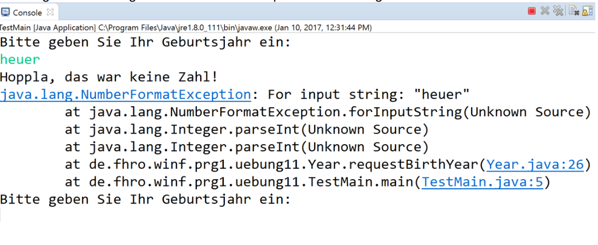
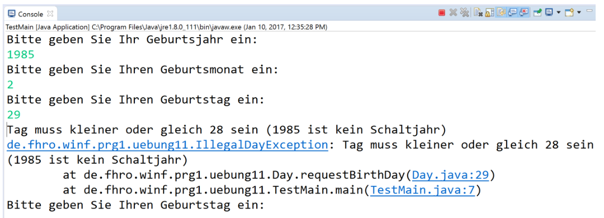

# Übung 14 - Exceptions

- [Aufgabe 1](#aufgabe-1)
- [Aufgabe 2: Verwenden vordefinierter Ausnahmeklassen](#aufgabe-2-verwenden-vordefinierter-ausnahmeklassen)
- [Aufgabe 3: Erstellen benutzerdefinierter Ausnahmeklassen](#aufgabe-3-erstellen-benutzerdefinierter-ausnahmeklassen)
- [Hilfestellung](#hilfestellungen)

## Kernthemen

- Unterschied zwischen Checked und Unchecked Exceptions
- Schreiben von eigenen Ausnahmeklassen
- Auslösen von Exceptions über throw
- „Gefühl bekommen“ für vorgefertigte Ausnahmeklassen
- Weitergabe von Exceptions über throws mit späterem Abfangen
- Anzeigen der Stack Trace für leichtere Nachverfolgbarkeit
- Abfangen von Exceptions über einen try-catch(-finally)-Block

## Aufgabe 1

Im Folgenden implementieren Sie ein Programm, das vom Benutzer dessen Geburtsjahr, -monat und
–tag erfragt und anschließend das Geburtsdatum auf der Konsole ausgibt.

1. Implementieren Sie eine Klasse Year, die genau ein ganzzahliges Attribut namens year besitzt,
   welches durch den Standard-Konstruktor mit dem Wert 0 initialisiert werden soll. Ergänzen Sie
   einen weiteren geeigneten Konstruktor sowie die für eine vollständige Datenkapselung
   notwendigen Zugriffsmethoden
2. Definieren Sie für die Klasse Year eine statische Methode requestBirthYear(), die den Benutzer
   auffordert, sein Geburtsjahr einzugeben, den eingegebenen Wert anschließend von der Konsole
   einliest und den eingelesenen Wert zurückliefert.
   (Implementierungshinweis: Verwenden Sie zum Einlesen die Klasse Scanner, sowie die Methode
   Integer.parseInt.)
3. Implementieren Sie analog zu den Teilaufgaben 1 und 2 eine Klasse Month mit dem Attribut
   month. Ergänzen Sie diese ebenfalls um die zugehörigen Zugriffsmethoden und geeignete
   Konstruktoren. Definieren Sie ferner eine statische Methode requestBirthMonth(), die den
   Benutzer auffordert, seinen Geburtsmonat einzugeben, den eingegebenen Wert anschließend von
   der Konsole einliest und den eingelesenen Wert zurückliefert.
4. Implementieren Sie analog zu den Teilaufgaben 1 und 2 eine Klasse Day mit dem Attribut day.
   Ergänzen Sie diese ebenfalls um die zugehörigen Zugriffsmethoden und geeignete Konstruktoren.
   Definieren Sie ferner eine statische Methode requestBirthDay(), die den Benutzer auffordert,
   seinen Geburtstag einzugeben, den eingegebenen Wert anschließend von der Konsole einliest
   und den eingelesenen Wert zurückliefert.

## Aufgabe 2: Verwenden vordefinierter Ausnahmeklassen

Modifizieren Sie nun die requestBirth<DateElement>()-Methoden Ihrer Klassen für die einzelnen
Datenelemente so, dass folgende Forderung erfüllt wird:

- Falls der Benutzer bei einer der Eingaben keine gültige Zahl eingibt, sollte eine geeignete
  Fehlermeldung angezeigt werden. Anschließend sollte der Benutzer erneut zur Eingabe des gerade
  gewünschten Wertes aufgefordert werden. Dieses Vorgehen wiederholt sich so lange, bis der
  Benutzer für den gesuchten Wert erfolgreich eine Zahl eingegeben hat.

Stützen Sie Ihre lokale Ausnahmebehandlung auf die vordefinierte Klasse NumberFormatException
ab. Geben Sie dabei neben der Meldung an den Benutzer auch noch ein entsprechendes Protokoll
der aufgetretenen Ausnahme auf der Standardausgabe aus.
(Implementierungshinweis: Verwenden Sie die Objektmethode printStackTrace mit dem
Aufrufargument System.out.)

Die Ausgabe Ihres Programms könnte nun beispielsweise wie folgt aussehen:

## Aufgabe 3: Erstellen benutzerdefinierter Ausnahmeklassen

Das Programm validiert die Benutzereingaben bisher lediglich hinsichtlich der Syntax, jedoch nicht
hinsichtlich der eingegebenen Werte. Es ist also beispielsweise möglich, als Geburtsdatum den
42.14.1977 einzugeben, obwohl dieses Datum gar nicht existiert.

1. Prüfen Sie zunächst in der Klasse Month bei der Eingabe des Geburtsmonats, ob für den
   eingelesenen Monatswert m gilt, dass 1 <= m <= 12. Falls diese Bedingung verletzt ist, soll eine
   geeignete Ausnahme ausgelöst werden. Implementieren Sie dafür eine neue einfache
   Ausnahmeklasse namens IllegalMonthException. Fangen Sie diese Ausnahme lokal ab und
   behandeln Sie diese auf folgende Weise: Dem Benutzer soll eine Meldung ausgegeben, werden,
   dass der Wert für Monat zwischen 1 und 12 liegen muss. Ferner soll auch eine Protokollierung der
   aufgetretenen Ausnahme analog zu Aufgabe 2 erfolgen. Zusätzlich soll dem Benutzer die
   Möglichkeit gegeben werden, dass er seine fehlerhafte Eingabe korrigiert.
2. Prüfen Sie analog in der Klasse Day bei der Eingabe des Geburtstages, ob der eingelesene Wert
   gemeinsam mit den zuvor eingelesenen Werten für Monat und Jahr überhaupt ein gültiges Datum
   ergibt. Um das ermitteln zu können, müssen der Methode requestBirthDay() die Werte für Monat
   und Jahr des Geburtsdatums bekannt sein. Erweitern Sie daher die Signatur der Methode um
   zwei Aufrufparameter, ebenso wie alle Stellen in Ihrem Programm, an denen diese Methode
   aufgerufen wird.

Da diese Prüfung aufgrund der unterschiedlichen Längen des Februars in Schaltjahren und
„normalen“ Jahren relativ aufwändig ist, sollten Sie diese in eine eigene Methode namens
validateDay() auslagern. Dieser Methode werden alle Werte, die zur Prüfung der korrekten
Datumszusammensetzung benötigt werden, übergeben (Wert für Tag, Wert für Jahr und Wert für
Monat).

Berechnung Schaltjahr:
- ist ein Jahr durch vier teilbar ist es ein Schaltjahr
- ist das Jahr zusätzlich durch 100 teilbar, dann ist es kein Schaltjahr
- wenn es aber durch 100 und durch 400 teilbar ist, dann ist es doch wieder ein Schaltjahr

Falls der eingegebene Geburtstag gemeinsam mit den Werten für Monat und Jahr kein gültiges
Datum ergibt, soll eine geeignete Ausnahme ausgelöst werden. Implementieren Sie dafür eine
neue Ausnahmeklasse namens IllegalDayException, die fehlerspezifische Informationen
weitergibt. Fangen Sie diese Ausnahme lokal ab und behandeln Sie diese auf geeignete Weise.
Geben Sie dabei dem Benutzer die Möglichkeit, seine fehlerhafte Eingabe zu korrigieren.

Die Ausgabe des Programms könnte wie folgt aussehen:

## Hilfestellungen

n dieser Übung beschäftigen Sie sich mit dem Thema Exceptions. Sie werden also in dieser Übung vordefinierte Exceptions verwenden, und aber auch eigens von Ihnen implementierte Exceptions erzeugen.
Hier ein hilfreiches Video, um das Thema Exceptions zu wiederholen:

Fehler und Exceptions: https://www.youtube.com/watch?v=Ww0CEEjQZb8

Viel Spaß!